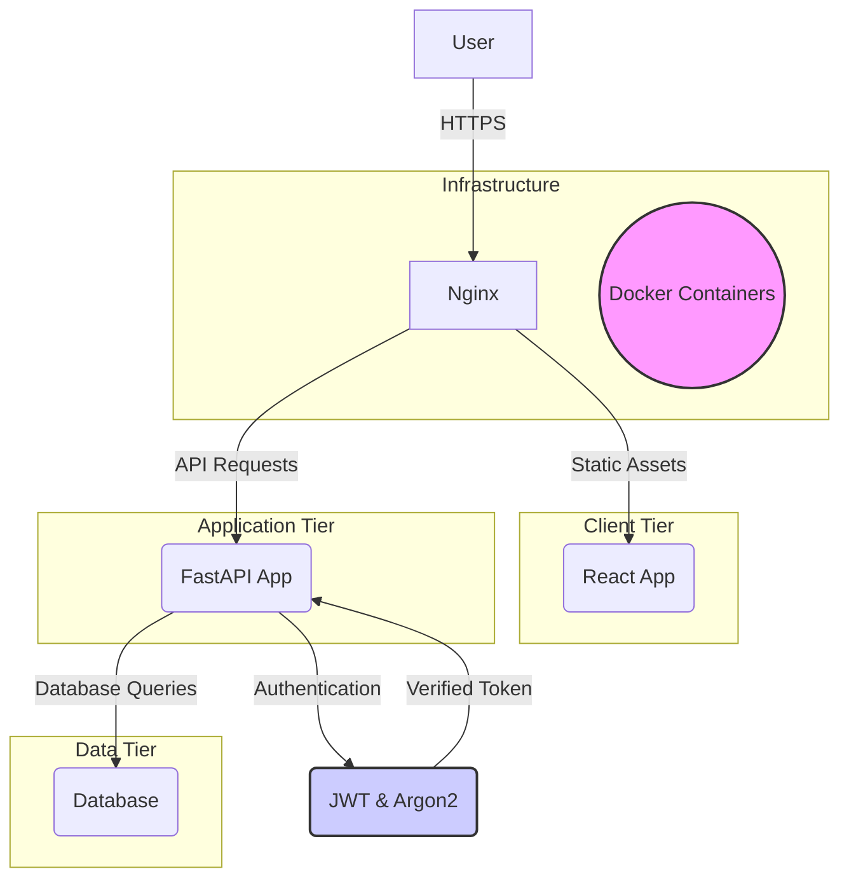

# Architecture Patterns

**Domain:** Gamified Educational Platform (QuestLab)
**Researched:** 2024-07-31

## Recommended Architecture

QuestLab employs a robust multi-tier client-server architecture designed for scalability, maintainability, and security. It separates concerns across distinct services, orchestrated using Docker Compose for consistent deployment.



### Component Boundaries

| Component | Responsibility | Technologies | Communicates With |
|-----------|---------------|--------------|-------------------|
| **Client (Frontend)** | User Interface, User Experience, content presentation, gamification visuals, API interaction. | React, Vite, TypeScript, TailwindCSS, Axios, React Router DOM | Backend (via HTTP/HTTPS) |
| **API Server (Backend)** | Core business logic, user/auth management, lesson/quest logic, gamification mechanics (XP, badges), progress tracking, data validation, API endpoint exposure. | FastAPI, Python, SQLAlchemy, Pydantic, Argon2-cffi, python-jose, Uvicorn | Frontend, PostgreSQL |
| **Database** | Persistent storage for all application data: users, roles, lessons, quizzes, mini-games, progress records, achievements, in-game currency, content metadata. | PostgreSQL, psycopg2-binary | Backend |
| **Reverse Proxy / Web Server** | Serves static frontend assets, proxies API requests to backend, handles SSL termination, potentially load balancing and caching. | Nginx | Client (browser), Backend |
| **Containerization** | Encapsulates each service (frontend, backend, database, Nginx) into isolated, portable units. Manages their lifecycle and interconnections. | Docker, Docker Compose | All services |

### Data Flow

1.  **Initial Load**: User's browser requests `questlab.com`. Nginx serves the React application's static files (HTML, CSS, JS) to the browser.
2.  **User Interaction**: Frontend renders UI. User performs an action (e.g., login, start lesson, submit quiz).
3.  **API Request**: React frontend makes an asynchronous API request (e.g., `POST /auth/login`, `GET /lessons/123/quest`) to Nginx using Axios.
4.  **Request Routing**: Nginx receives the request. If it's an API route (e.g., `/api/*`), Nginx forwards it to the FastAPI backend container. If it's for static assets, Nginx serves them directly.
5.  **Backend Processing**: FastAPI backend receives the request.
    *   **Authentication/Authorization**: Validates JWT token (if present) using `python-jose`. If new login, uses Argon2 to hash/verify passwords.
    *   **Business Logic**: Executes relevant logic (e.g., fetch lesson data, update user progress, calculate XP).
    *   **Data Access**: Interacts with the PostgreSQL database via SQLAlchemy ORM to retrieve or store data.
6.  **Response**: FastAPI constructs a JSON response.
7.  **Response Routing**: FastAPI sends the response back to Nginx, which then forwards it to the user's browser.
8.  **UI Update**: React frontend receives the JSON response and updates the user interface accordingly (e.g., displays lesson content, shows new XP, navigates to dashboard).

## Patterns to Follow

### Pattern 1: Layered Backend Architecture
**What:** Separate the backend into distinct layers: presentation (routers/API endpoints), business logic (services/managers), and data access (ORM models/repository).
**When:** Always for FastAPI applications to maintain modularity, testability, and separation of concerns.
**Example:**
```python
# routers/lessons.py (Presentation)
@router.get("/lessons/{lesson_id}")
async def get_lesson_endpoint(lesson_id: int, db: SessionDep):
    return lesson_service.get_lesson(db, lesson_id)

# services/lesson.py (Business Logic)
def get_lesson(db: Session, lesson_id: int):
    # Apply business rules, security checks
    return db.query(models.Lesson).filter(models.Lesson.id == lesson_id).first()

# models.py (Data Access/ORM)
class Lesson(Base):
    __tablename__ = "lessons"
    id = Column(Integer, primary_key=True, index=True)
    title = Column(String, index=True)
```

### Pattern 2: Stateless JWT Authentication
**What:** Use JSON Web Tokens for authentication. Once a user logs in, they receive a token which they include in subsequent requests. The backend validates the token without needing to store session state.
**When:** Ideal for APIs, microservices, and distributed systems where scalability and statelessness are important.
**Example:** Implemented using `python-jose` for token creation/validation and Argon2 for secure password hashing.

### Pattern 3: Database Migrations
**What:** Use tools like Alembic (for SQLAlchemy) to manage database schema changes programmatically.
**When:** Essential for any evolving application to ensure that database changes are version-controlled, repeatable, and applied consistently across environments.

## Anti-Patterns to Avoid

### Anti-Pattern 1: Fat Client / Thin Server
**What:** Placing excessive business logic and data validation solely on the frontend.
**Why bad:** Leads to security vulnerabilities (client-side logic can be bypassed), poor maintainability, and inconsistent behavior across different clients or if client-side scripting is disabled.
**Instead:** Implement all critical business logic and data validation on the backend. Frontend should primarily focus on UI/UX, with backend providing robust APIs.

### Anti-Pattern 2: Direct Database Access from Frontend
**What:** Allowing the frontend to directly connect to and query the database.
**Why bad:** Major security hole, exposes database credentials, and bypasses all backend business logic and access control.
**Instead:** All data access must go through the FastAPI backend API.

### Anti-Pattern 3: Inconsistent API Design
**What:** Using varied naming conventions, HTTP methods, and response formats across different API endpoints.
**Why bad:** Makes the API difficult to learn, use, and maintain for frontend developers and other consumers.
**Instead:** Adhere to RESTful principles, consistent naming (e.g., snake_case for Python, camelCase for JS), clear status codes, and standardized error responses. FastAPI's Pydantic models help enforce consistency.

## Scalability Considerations

| Concern | At 100 users | At 10K users | At 1M users |
|---------|--------------|--------------|-------------|
| **Backend Load** | Single FastAPI/Uvicorn instance sufficient. | Multiple FastAPI instances behind Nginx (horizontal scaling) using Docker Swarm/Kubernetes. | Microservices architecture, distributed caching (Redis), message queues, read-heavy database optimization. |
| **Database Performance** | Single PostgreSQL instance. Adequate indexing. | Optimized queries, connection pooling (PgBouncer), read replicas. | Database sharding/clustering, advanced caching strategies, data warehousing for analytics. |
| **Frontend Assets** | Nginx serves static files directly. Browser caching. | CDN for global distribution of static assets. | Advanced CDN features, edge computing. |
| **Auth/Security** | Basic JWT. Argon2 hashing. | Rate limiting, WAF (Web Application Firewall), DDoS protection. | Advanced threat detection, secure API gateways, compliance certifications. |

## Sources

- `/home/onant/opt/questlab/Project_Goals.md`
- `/home/onant/opt/questlab/.planning/research/STACK.md`
- General knowledge of modern web application architecture and best practices.
