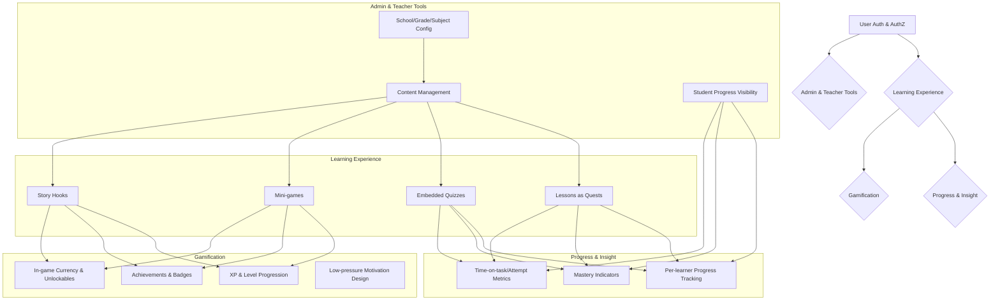

# Feature Landscape

**Domain:** Game-first, culturally relevant learning for Caribbean students
**Researched:** 2024-07-31

## Table Stakes

Features users expect from a modern learning platform. Missing these would make the product feel incomplete.

| Feature | Why Expected | Complexity | Notes |
|---------|--------------|------------|-------|
| Lessons structured as quests | Core learning content delivery. Users expect structured learning paths. | Medium | Quest framing is a differentiator, but "lessons" are table stakes. |
| Embedded quizzes with immediate feedback | Essential for self-assessment and reinforcing learning objectives. | Medium | Feedback mechanism is crucial for mastery-based learning. |
| Per-learner progress tracking | Users (students, parents, teachers) need to see learning journey and completion. | Medium | Basic functionality for any educational platform. |
| Mastery indicators | Shows understanding of topics, critical for mastery-based progression. | Medium | Connects directly to the core pillar of mastery. |
| Admin & Teacher Tools: Content Management | Teachers/admins need to create, edit, organize lessons, quizzes, games. | High | Foundation for a scalable content ecosystem. |
| Admin & Teacher Tools: School/Grade/Subject Config | Essential for organizing learners and curriculum by educational structure. | Medium | Allows flexible setup for different schools/regions. |
| Admin & Teacher Tools: Student Progress Visibility | Teachers/parents need to monitor student activity and performance. | Medium | Critical for supporting and guiding learners. |
| User Authentication & Authorization | Secure access for different user roles (student, teacher, admin). | Medium | Fundamental security and access control. |

## Differentiators

Features that set QuestLab apart from generic learning platforms, directly supporting its core mission.

| Feature | Value Proposition | Complexity | Notes |
|---------|-------------------|------------|-------|
| Game-Driven Learning (lessons as quests, learning through interaction) | Makes learning engaging and intrinsically motivating, moving away from traditional passive methods. Directly addresses "game-first" mission. | High | Requires careful game design and integration with learning content. |
| Caribbean-First Context (culture, history, geography) | Fosters cultural pride and relevance, making learning more relatable and impactful for target users. | High | Requires specialized content creation and cultural sensitivity. |
| Mini-games reinforcing lesson objectives | Breaks monotony, provides varied practice, and makes learning feel like play rather than work. | High | Each mini-game needs design, development, and integration. |
| Story hooks and contextual challenges | Builds narrative immersion, encouraging exploration and sustained engagement beyond individual lessons. | Medium | Requires narrative writing and integration with quest flow. |
| XP and level progression | Provides visible progress, a sense of achievement, and encourages continued engagement through gamified rewards. | Medium | Requires backend logic for tracking and frontend display. |
| Achievements and badges | Offers extrinsic motivation, celebrates milestones, and provides visual recognition of effort and mastery. | Medium | Design and implementation of various badges/achievements. |
| In-game currency and unlockables | Gives learners agency and choice in customizing their experience, reinforcing motivation. | Medium | Requires a virtual economy system and associated assets. |
| Low-pressure motivation (personal growth over competition, no leaderboard anxiety) | Creates a safe and supportive learning environment, appealing to a broader range of learners who may be intimidated by competitive systems. | Medium | Requires careful design of gamification mechanics to avoid unhealthy competition. |
| Time-on-task and attempt metrics | Provides granular insight into learning behaviors, enabling more targeted support and understanding of mastery pathways. | Medium | More detailed than basic progress tracking, feeds into mastery. |

## Anti-Features

Features to explicitly NOT build, as they go against QuestLab's core philosophy or are explicitly out of scope.

| Anti-Feature | Why Avoid | What to Do Instead |
|--------------|-----------|-------------------|
| Real-time multiplayer gameplay | High complexity and overhead; goes against low-pressure, individual mastery focus. | Focus on single-player game-driven learning experiences. |
| High-stakes exams or timed tests | Directly contradicts "low-pressure motivation" and "exploration over high-pressure exams." | Use embedded quizzes with immediate feedback and mastery indicators for assessment. |
| Competitive global leaderboards | Explicitly goes against "low-pressure motivation" and "rewards without leaderboard anxiety." | Focus on personal progression, achievements, and individual mastery. |
| External LMS integrations | Adds significant integration complexity and dependency on third-party systems; outside initial scope. | Build core teacher/admin tools internally; defer integrations to much later stages if truly necessary. |
| Monetization beyond pilot-friendly models | Not a primary goal for v1-v2; focus is on educational impact, not revenue generation. | Keep the platform accessible and focus on educational value for initial pilots. |

## Feature Dependencies

## MVP Recommendation

For MVP, prioritize:
1.  **User Authentication & Authorization**: Foundation for all user interactions.
2.  **Lessons structured as quests**: Core learning content delivery.
3.  **Embedded quizzes with immediate feedback**: Basic assessment and mastery.
4.  **Per-learner progress tracking & Mastery indicators**: Essential feedback for learners and educators.
5.  **Basic Admin & Teacher Tools (Content Management, Student Progress Visibility)**: To enable educators to create content and monitor initial pilot usage.
6.  **One or two key Differentiators**: Start with **XP and Level Progression** and **Achievements/Badges** to establish the game-first feel without over-complicating.

Defer to post-MVP:
-   **Mini-games reinforcing lesson objectives**: Complex, can be added after core lesson flow is solid.
-   **In-game currency and unlockables**: Requires a virtual economy, defer until gamification core is stable.
-   **Comprehensive Story hooks and contextual challenges**: Can be iterated upon, focus on core quest narrative first.
-   **Advanced Admin & Teacher Tools (e.g., School/Grade/Subject configuration)**: Focus on a single-school/tenant model initially.

## Sources

- `/home/onant/opt/questlab/Project_Goals.md`
- General knowledge of educational technology platforms and gamification principles.
