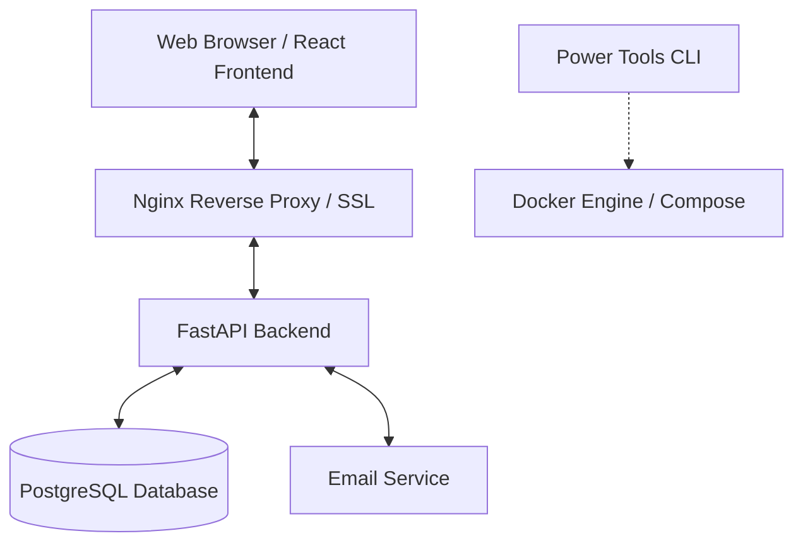

# QuestLab Architecture & Engineering Guide (GEMINI.md)

This document serves as the authoritative architectural blueprint and engineering guide for **QuestLab**, a gamified educational platform. It bridges the gap between high-level project goals and technical implementation details, providing a unified source of truth for developers and AI agents.

---

## 1. Project Overview

QuestLab is a full-stack, containerized web application that provides interactive, gamified learning experiences. 
- **Core Mission**: Active learning through interaction, not passive consumption.
- **Key Features**: Gamified lessons, quizzes, progress tracking, typing challenges, and role-based dashboards (Student, Teacher, Parent, Admin).
- **Primary Stack**: React (Vite/TS), FastAPI (Python), PostgreSQL, Nginx, Docker.

---

## 2. System Architecture

QuestLab follows a decoupled, service-oriented architecture managed by Docker Compose.



### Stack Components
- **Frontend**: Single Page Application (SPA) built with React 18 and Vite.
- **Backend**: Asynchronous REST API powered by FastAPI and SQLAlchemy 2.0.
- **Reverse Proxy**: Nginx handles SSL (Certbot) and routes traffic to frontend/backend services.
- **Database**: PostgreSQL for persistent state and structured data.
- **Automation**: "Power Tools" (Bash/TUI) for rapid development and deployment orchestration.

---

## 3. Project Structure

```text
questlab/
├── backend/                # FastAPI Application
│   ├── main.py             # App entry point & middleware
│   ├── models.py           # SQLAlchemy database models
│   ├── database.py         # DB engine & SessionLocal setup
│   ├── dependencies.py     # FastAPI dependency injection (Auth, DB)
│   ├── routers/            # Modular API endpoints (auth, games, etc.)
│   ├── schemas/            # Pydantic models for validation (DTOs)
│   ├── templates/          # Jinja2 templates (Email, etc.)
│   ├── tasks.py            # Background/Asynchronous tasks
│   └── tests/              # Backend unit/integration tests (Pytest)
├── frontend/               # React Application
│   ├── src/
│   │   ├── pages/          # View components (Routing targets)
│   │   ├── components/     # Reusable UI primitives (Shadcn/UI)
│   │   ├── hooks/          # Custom React hooks
│   │   ├── lib/            # Utilities (Axios instance, helpers)
│   │   └── config/         # App-wide configuration
│   └── public/             # Static assets
├── nginx/                  # Nginx & SSL Configuration
├── tests/                  # Playwright E2E tests
├── quest-scripts/          # Operational scripts (seed, backup, fix)
├── .planning/              # Project roadmap and state tracking
├── ARCHITECTURE.md         # Detailed Power Tools documentation
├── docker-compose.yml      # Service orchestration
└── GEMINI.md               # This document (Engineering Guide)
```

---

## 4. Frontend Architecture (React)

The frontend is a component-driven React application prioritizing type safety and modularity.

### Core Principles
- **State Management**: 
    - **Server State**: Managed via Axios and local component hooks. (Future: TanStack Query).
    - **UI State**: Local `useState`/`useContext` for modals, forms, and toggles.
    - **Auth State**: Centralized and explicit, typically stored in `localStorage` or session-based.
- **Styling**: Tailwind CSS for responsive, utility-first design.
- **Routing**: `react-router-dom` (v6+) for declarative navigation.
- **Components**: Functional components with hooks; composition over prop-drilling.

### Directory Mapping
- `src/pages/`: Contains domain-specific directories (`admin/`, `parent/`) and top-level pages.
- `src/components/ui/`: Low-level, reusable components (often Radix/Shadcn).
- `src/lib/axios.ts`: Centralized HTTP client with interceptors for auth headers.

---

## 5. Backend Architecture (FastAPI)

The backend follows a layered pattern: **Router -> Dependency -> Schema -> Model**.

### Core Principles
- **Separation of Concerns**:
    - **Routers**: Orchestrate requests, handle HTTP status codes, and call logic.
    - **Dependencies**: Handle cross-cutting concerns (Auth, DB sessions, permissions).
    - **Schemas (Pydantic)**: Strict data validation for requests and responses.
    - **Models (SQLAlchemy)**: Database schema definitions and relationships.
- **Asynchronous Execution**: Native `async`/`await` for I/O-bound operations.
- **Authentication**: JWT-based Bearer token authentication.

### Key Files
- `backend/models.py`: Centralized source of truth for the database schema.
- `backend/routers/`: Modularized by domain (e.g., `lessons.py`, `games.py`, `auth.py`).
- `backend/schemas/`: Contains request/response models. `__init__.py` acts as a central registry.

---

## 6. Infrastructure & Deployment

### Power Tools CLI
QuestLab includes a specialized CLI for DevOps tasks. Refer to `ARCHITECTURE.md` for full details.
- `menu`: Interactive TUI for deployment and monitoring.
- `qup`/`qdown`: Shortcuts for Docker Compose.
- `db-backup`/`db-restore`: Database lifecycle management.

### Docker Environment
- **Development**: `docker compose up --build` launches the full stack with hot-reloading for frontend.
- **Production**: Uses Nginx as a reverse proxy with SSL provided by Certbot.
- **Environment Variables**: Managed via `.env` files (never committed). `.env.example` provides the template.

---

## 7. Testing Strategy

QuestLab employs a layered testing approach to ensure stability.

### E2E Testing (Playwright)
- **Authority**: Playwright is the primary tool for user journey verification.
- **Location**: `/tests/*.spec.ts`
- **Focus**: Authentication, critical lesson flows, and complex UI interactions.
- **Command**: `npx playwright test`

### Backend Testing (Pytest)
- **Location**: `backend/tests/`
- **Focus**: API endpoint validation, auth logic, and business rules.
- **Command**: `pytest` inside the backend container/environment.

---

## 8. Extension Guidelines

To add a new feature (e.g., "Achievements"):
1. **Database**: Add the `Achievement` model to `backend/models.py`.
2. **Schema**: Define `AchievementCreate` and `Achievement` schemas in `backend/schemas/`.
3. **Router**: Create `backend/routers/achievements.py` and register it in `backend/main.py`.
4. **Frontend API**: Add relevant API calls in a new hook or utility file.
5. **UI**: Create the page in `frontend/src/pages/` and the route in `App.tsx`.
6. **Test**: Add a Playwright spec in `tests/` to verify the end-to-end flow.

---

## 9. AI Engineering Mandates

When assisting with QuestLab, AI agents MUST adhere to these rules:

### Security & Integrity
- **No Secrets**: Never log or commit API keys, passwords, or `.env` content.
- **Git Safety**: Do not stage/commit unless explicitly directed. Always provide a draft commit message.

### Quality Standards
- **Surgical Edits**: Prefer `replace` over `write_file` for large files. Keep changes focused.
- **Idiomatic Code**: Use React functional components, TypeScript types, and FastAPI dependencies.
- **Verification**: Always run tests (or suggest running them) after changes.
- **Validation**: For bug fixes, reproduce the failure with a test case first.

### Quality Philosophy
- Quality is built-in. Suggest tests for critical logic.
- Avoid flaky timing-based assertions in Playwright. Use role-based selectors.
- Prefer explicit configuration over "magic" defaults.
- One command should bootstrap the full stack.
